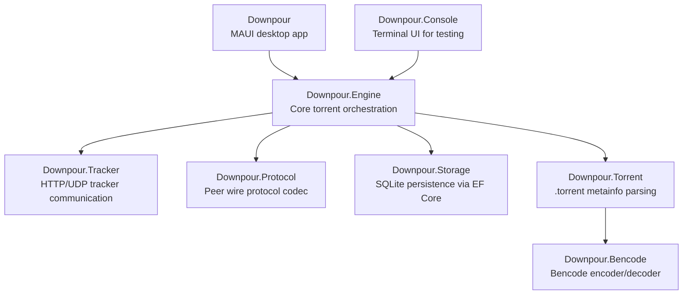

# Downpour

A BitTorrent client written in F# and C# targeting .NET 10, built as a MAUI desktop application with a layered library architecture.

## App structure

## Components

### Downpour (C# / MAUI) (WIP)

MVVM desktop UI using CommunityToolkit.Mvvm. Shows a live torrent list with name, status, size, progress, speeds, and peer count. The custom title bar holds Add/Pause/Resume/Remove actions; a bottom toolbar filters by status. `SettingsService` persists listen port and speed limits as JSON.

### Downpour.Console (C#)

Terminal.Gui TUI used for manual engine testing. Supports adding, pausing, resuming, and removing torrents via keyboard shortcuts and shows live progress in a scrollable list.

### Downpour.Engine (F#)

Orchestrates everything. `Engine` owns one `EngineAgent` MailboxProcessor that serializes all top-level commands (add, remove, pause, resume, settings). Each active torrent gets its own `TorrentAgent` MailboxProcessor that manages the download state machine: piece verification on start, tracker announcements, peer slot management, block pipelining, SHA-1 verification, and seeding. `PeerAgent` handles a single TCP peer connection. `PieceStore` handles on-disk block reads, writes, and bitfield management. Progress and status changes are broadcast via `IObservable<EngineEvent>`.

### Downpour.Tracker (F#)

Announces to HTTP trackers (BEP-3) and UDP trackers (BEP-15). Returns peer lists and reannounce intervals.

### Downpour.Protocol (F#)

Serializes and deserializes the BitTorrent peer wire protocol. Covers the 68-byte handshake and all standard peer messages: `KeepAlive`, `Choke`, `Unchoke`, `Interested`, `NotInterested`, `Have`, `Bitfield`, `Request`, `Piece`, and `Cancel`.

### Downpour.Storage (C#)

SQLite persistence via Entity Framework Core. Stores torrent metadata, piece bitfields, transfer totals, and status. All repository operations are serialized through a semaphore because multiple `TorrentAgent` instances share the same `DbContext`.

### Downpour.Torrent (F#)

Parses `.torrent` files into `TorrentMetaInfo`: announce URLs, piece SHA-1 hashes, piece length, and file layout (`SingleFile` or `MultiFile`). Computes the info-hash as SHA-1 of the raw bencoded `info` dictionary.

### Downpour.Bencode (F#)

Encodes and decodes the bencode format. The `BencodeValue` discriminated union covers integers, byte strings, lists, and dictionaries. Dictionary keys are sorted lexicographically on encode for deterministic output.
