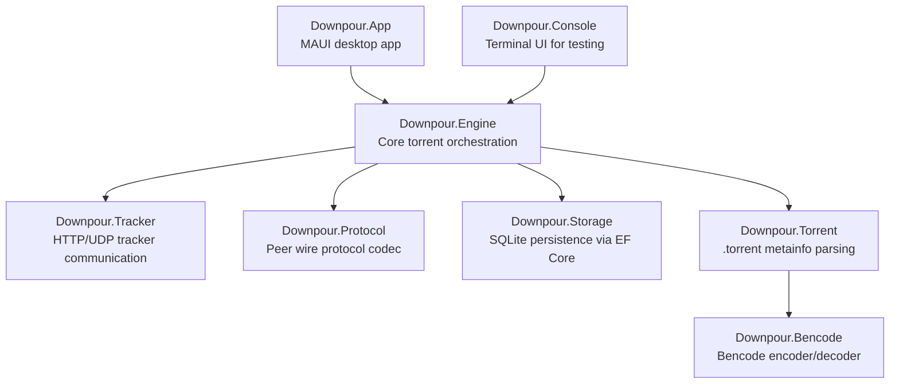

# Downpour

A BitTorrent client written in F# and C# targeting .NET 10, built as a MAUI desktop application.

# Build Instructions

The project targets Windows. All development was done in Rider 2025.3.2. No other platforms were tested. Visual Studio was not tested. The app can either be built/rand with the command line via `dotnet` or throught the IDE.

## App structure

## Features

- Add single or multiple `.torrent` files at once with folder selection
- Live torrent list with name, status badge, progress bar, download/upload speed, peer count
- Pause, resume, remove, and delete (with files) individual torrents
- Per-torrent details page with a mini live speed chart
- Global speed history chart at the bottom 
- Settings: listen port, seeding toggle, download/upload throttle limits
- All-time downloaded/uploaded totals in the toolbar
- SQLite persistence for torrents, piece bitfields, and transfer totals survive restarts

## Components

### Downpour.App (C# / MAUI)

MAUI desktop app for Windows targeting .NET 10 with a Mica backdrop. Uses CommunityToolkit.Mvvm, ViewModels hold only observable state and commands, rest is handled by injected services:

| Service | Responsibility |
|---|---|
| `INavigationService` | Constructs pages and pushes/pops modal dialogs |
| `IDialogService` | Alert and confirmation dialogs via `Shell.Current` |
| `IFilePickerService` | Platform file/folder picker APIs |
| `ISpeedHistoryService` | In-memory ring buffers (120 samples ≈ 2 min) for global and per-torrent speed history |
| `SettingsService` | Persists listen port and throttle limits as JSON |

The main view shows a `CollectionView` of `TorrentItemViewModel`s updated once per second from a background timer. A `SpeedChartView` renders an area chart with gradient fill.

### Downpour.Console (C#)

Simple lightweight app for testing functionality, replaced by `Downpour.App
`
### Downpour.Engine (F#)

Orchestrates everything. `Engine` owns one `EngineAgent` MailboxProcessor that serializes all top-level commands (add, remove, pause, resume, settings, incoming TCP). Each active torrent gets its own `TorrentAgent` MailboxProcessor that manages the download state machine: piece verification on start, HTTP/UDP tracker announcements, peer slot management, block pipelining, SHA-1 piece verification, and seeding after completion. `PeerAgent` handles a single TCP peer connection. `PieceStore` handles on-disk block reads, writes, and bitfield management. Progress and status changes are broadcast via `IObservable<EngineEvent>`. Download and upload speeds can be throttled via `EngineSettings`.

### Downpour.Tracker (F#)

Announces to HTTP trackers (BEP-3) and UDP trackers (BEP-15). Returns peer lists and reannounce intervals.

### Downpour.Protocol (F#)

Serializes and deserializes the BitTorrent protocol. Covers the 68-byte handshake and all standard peer messages: `KeepAlive`, `Choke`, `Unchoke`, `Interested`, `NotInterested`, `Have`, `Bitfield`, `Request`, `Piece`, and `Cancel`.

### Downpour.Storage (C#)

SQLite persistence via Entity Framework Core. Stores torrent metadata, piece bitfields, transfer totals, and status. All repository operations are serialized through a semaphore because multiple `TorrentAgent` instances share the same `DbContext`.

### Downpour.Torrent (F#)

Parses `.torrent` files into `TorrentMetaInfo`: announce URLs, piece SHA-1 hashes, piece length, and file layout (`SingleFile` or `MultiFile`). Computes the info-hash as SHA-1 of the raw bencoded `info` dictionary.

### Downpour.Bencode (F#)

Encodes and decodes the bencode format. The `BencodeValue` discriminated union covers integers, byte strings, lists, and dictionaries. Dictionary keys are sorted lexicographically on encode for deterministic output.
