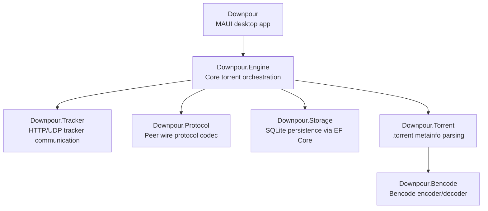

# Downpour

## App structure

```mermaid
graph TD
    Downpour["Downpour\nMAUI desktop app"]
    Downpour.Engine["Downpour.Engine\nCore torrent orchestration"]
    Downpour.Tracker["Downpour.Tracker\nHTTP/UDP tracker communication"]
    Downpour.Protocol["Downpour.Protocol\nPeer wire protocol codec"]
    Downpour.Storage["Downpour.Storage\nSQLite persistence via EF Core"]
    Downpour.Torrent["Downpour.Torrent\n.torrent metainfo parsing"]
    Downpour.Bencode["Downpour.Bencode\nBencode encoder/decoder"]

    Downpour --> Downpour.Engine
    Downpour.Engine --> Downpour.Tracker
    Downpour.Engine --> Downpour.Protocol
    Downpour.Engine --> Downpour.Storage
    Downpour.Engine --> Downpour.Torrent
    Downpour.Torrent --> Downpour.Bencode
```
